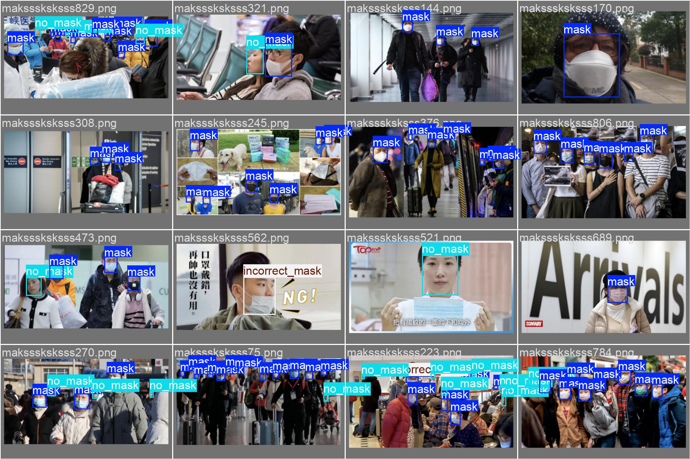

# Face Mask Detection with YOLOv8 🚀

## 🇪🇸 Español

### 🔄 Introducción

Este proyecto entrena un modelo **YOLOv8 personalizado** usando **Ultralytics** para detectar el uso de mascarillas en tiempo real o en imágenes estáticas. El modelo clasifica en **3 clases**:

* ✅ Mascarilla bien puesta
* ❌ Sin mascarilla
* ⚠️ Mascarilla mal puesta

Ya incluye el modelo entrenado y dos scripts de inferencia:

#### 🧠 Scripts de Inferencia

1. **Video Inference (`infer_video.py`)**
   Usa la webcam para hacer inferencias en tiempo real.

2. **Image Inference (`infer_image.py`)**
   Realiza inferencia sobre múltiples imágenes.
   Argumentos opcionales:

   * `--save_image`: guarda la imagen con las predicciones
   * `--number_images`: número de imágenes a inferir

#### 🖼️ Ejemplos de Resultados



---

### ⚙️ Preparación

## 🔄 Git LFS

Este repositorio usa [Git LFS](https://git-lfs.github.com/) para manejar archivos grandes como el modelo entrenado.

Instálalo primero:

```bash
brew install git-lfs        # macOS
sudo apt install git-lfs    # Ubuntu
git lfs install
```

1. **Clona este repositorio:**

```bash
git clone https://github.com/LiamKRP/FaceMaskDetectionYOLOv8.git
cd FaceMaskDetectionYOLOv8
git lfs pull
```

2. **Instala las dependencias:**

```bash
pip install -r requirements.txt
```

3. **Instala PyTorch y torchvision**
   Descárgalo según tu arquitectura desde:
   [https://pytorch.org/get-started/locally/](https://pytorch.org/get-started/locally/)

4. **Descarga el dataset y preparalo**
    Descarga el dataset desde:
    [https://www.kaggle.com/datasets/andrewmvd/face-mask-detection/data](https://www.kaggle.com/datasets/andrewmvd/face-mask-detection/data)
    Crea una carpeta llamada 'data' y mueve las carpetas 'images' y 'annotations' del dataset dentro del directorio 'data'
    Por ultimo ejecuta el script prepare_dataset.py
    ```bash
    python prepare_dataset.py
    ```

---

### 🔹 Inferencia

#### 📹 Inference en vídeo:

```bash
python infer_video.py
```

#### 🖼️ Inference en imágenes:

```bash
python infer_image.py
```

Con opciones:

```bash
python infer_image.py --number_images 5 --save_image
```

---

## 🌍 English

### 🔄 Introduction

This project trains a **custom YOLOv8 model** using the **Ultralytics library** to detect face masks in images or live video. It classifies detections into 3 categories:

* ✅ Mask worn correctly
* ❌ No mask
* ⚠️ Mask worn incorrectly

The repo includes a pre-trained model and two inference scripts.

#### 🧠 Inference Scripts

1. **Video Inference (`infer_video.py`)**
   Runs inference using the webcam in real time.

2. **Image Inference (`infer_image.py`)**
   Performs inference on a batch of images.
   Optional arguments:

   * `--save_image`: saves output images with bounding boxes
   * `--number_images`: sets how many images to run inference on

#### 🖼️ Example Outputs


---

### ⚙️ Setup

## 🔄 Git LFS

This repo uses [Git LFS](https://git-lfs.github.com/) to manage large files like the trained model checkpoint.

Install it:

```bash
brew install git-lfs        # macOS
sudo apt install git-lfs    # Ubuntu
git lfs install
```

1. **Clone this repository:**

```bash
git clone https://github.com/LiamKRP/FaceMaskDetectionYOLOv8.git
cd FaceMaskDetectionYOLOv8
git lfs pull
```

2. **Install dependencies:**

```bash
pip install -r requirements.txt
```

3. **Install PyTorch and torchvision**
   Visit [https://pytorch.org/get-started/locally/](https://pytorch.org/get-started/locally/) to get the right command for your system (OS, Python version, CUDA support, etc.).

4. **Download the dataset and prepare it**
    Download the dataset from:
    [https://www.kaggle.com/datasets/andrewmvd/face-mask-detection/data](https://www.kaggle.com/datasets/andrewmvd/face-mask-detection/data)
    Create a folder called 'data' and move the 'images' and 'annotations' folders of the downloaded dataset into the 'data' directory
    Execute the prepare_dataset.py script.
    ```bash
    python prepare_dataset.py
        ```

---

### 🔹 Inference

#### 📹 Video Inference:

```bash
python infer_video.py
```

#### 🖼️ Image Inference:

```bash
python infer_image.py
```

To save results and select the number of images:

```bash
python infer_image.py --number_images 5 --save_image
```
